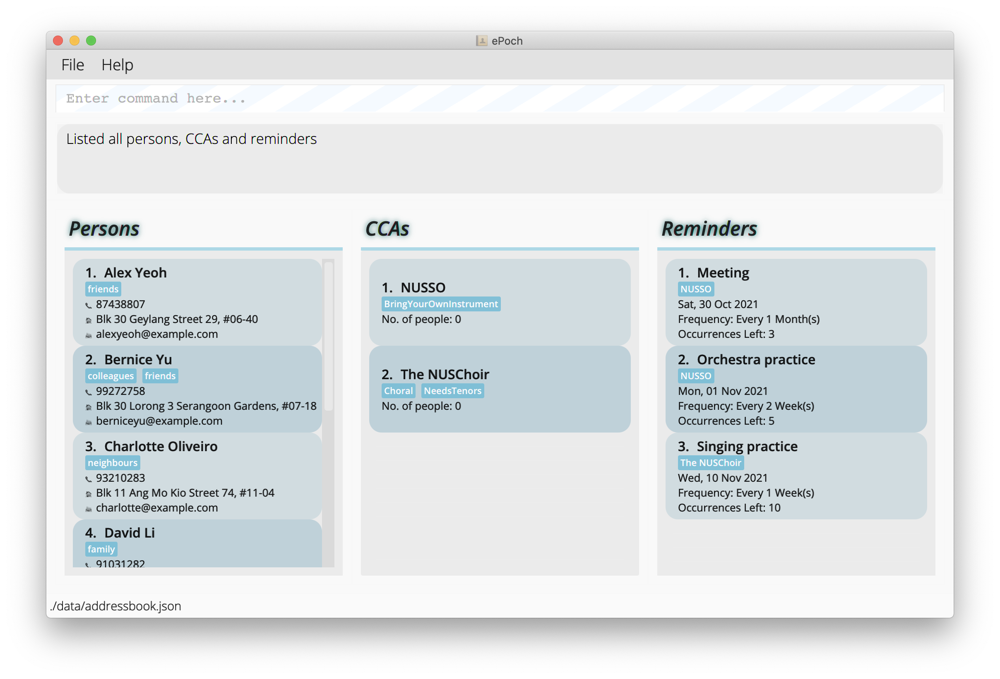

# **ePoch**
### CS2103-T14-2

* ePoch is a desktop app for managing contacts, optimized for use via a Command Line Interface (CLI) while still having the benefits of a Graphical User Interface (GUI). It has been designed for the busy NUS student, allowing the user to create contacts for persons and to create CCAs; link those persons and CCAs together; and to create periodic reminders for those CCAs.
* This contact manager is:
  * **written in OOP fashion**.
  * is based on the _AddressBook-Level3_ project created by the [SE-EDU initiative](https://se-education.org).
* Documentation for this project, such as the User Guide and Developer Guide, can be found in the `docs` folder.
* ePoch is a product of the CS2103 T14-2 team.
