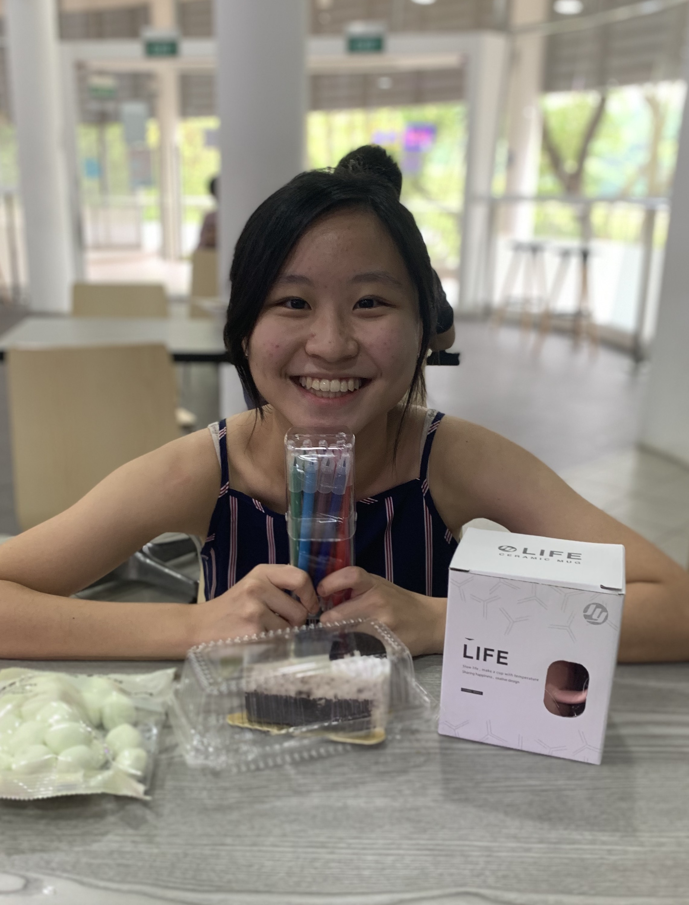
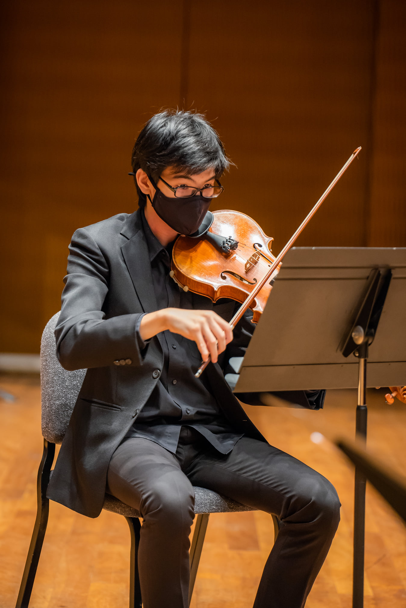

We are a team based in the [School of Computing, National University of Singapore](http://www.comp.nus.edu.sg).

## Project team

### Jivesh Mohan

[[github](https://github.com/jivesh)]
[[portfolio](team/jivesh.md)]

* Role: Developer
* Responsibilities: Integration, Git expert

### Jovyn Tan

[[github](http://github.com/jovyntls)]
[[portfolio](team/jovyntls.md)]

* Role: Team Lead
* Responsibilities: Scheduling and tracking, Deliverables and deadlines

### Neo Wei Qing

[[github](http://github.com/weiquu)]
[[portfolio](team/weiqing.md)]

* Role: Developer
* Responsibilities: Documentation, Code Quality

### Tan Yan Feng

[[github](http://github.com/justintanyf)]
[[portfolio](team/justintanyf.md)]

* Role: Developer
* Responsibilities: Intellij Expert, SourceTree Expert

### Teo Keane

[[github](http://github.com/okyntary)]
[[portfolio](team/okyntary.md)]

* Role: Developer
* Responsibilities: Gradle Expert, `Storage` component expert 
