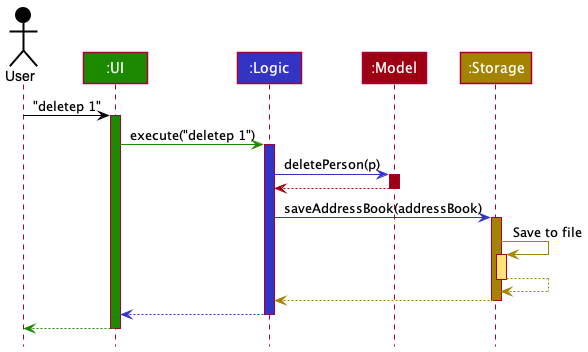
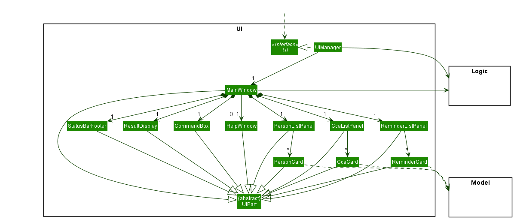
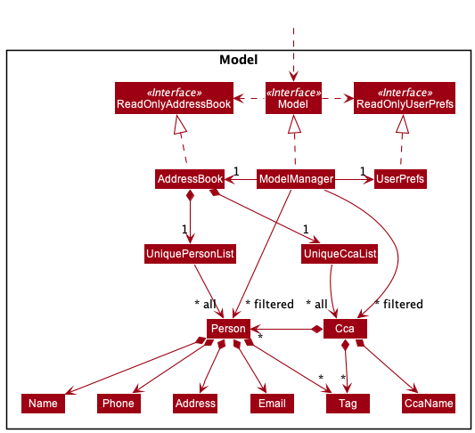
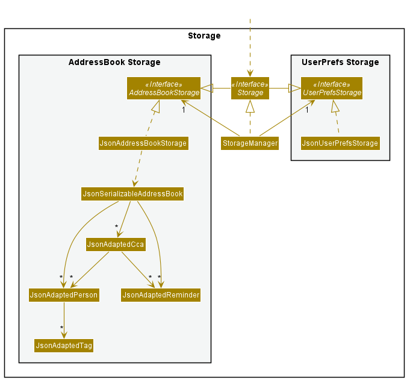

* Table of Contents
{:toc}

--------------------------------------------------------------------------------------------------------------------

## **Acknowledgements**

* {list here sources of all reused/adapted ideas, code, documentation, and third-party libraries -- include links to the original source as well}

--------------------------------------------------------------------------------------------------------------------

## **Setting up, getting started**

Refer to the guide [_Setting up and getting started_](SettingUp.md).

--------------------------------------------------------------------------------------------------------------------

## **Design**

:bulb: **Tip:** The `.puml` files used to create diagrams in this document can be found in the [diagrams](https://github.com/se-edu/addressbook-level3/tree/master/docs/diagrams/) folder. Refer to the [_PlantUML Tutorial_ at se-edu/guides](https://se-education.org/guides/tutorials/plantUml.html) to learn how to create and edit diagrams.

### Architecture

The ***Architecture Diagram*** given above explains the high-level design of the App.

Given below is a quick overview of main components and how they interact with each other.

**Main components of the architecture**

**`Main`** has two classes called [`Main`](https://github.com/se-edu/addressbook-level3/tree/master/src/main/java/seedu/address/Main.java) and [`MainApp`](https://github.com/se-edu/addressbook-level3/tree/master/src/main/java/seedu/address/MainApp.java). It is responsible for,
* At app launch: Initializes the components in the correct sequence, and connects them up with each other.
* At shut down: Shuts down the components and invokes cleanup methods where necessary.

[**`Commons`**](#common-classes) represents a collection of classes used by multiple other components.

The rest of the App consists of four components.

* [**`UI`**](#ui-component): The UI of the App.
* [**`Logic`**](#logic-component): The command executor.
* [**`Model`**](#model-component): Holds the data of the App in memory.
* [**`Storage`**](#storage-component): Reads data from, and writes data to, the hard disk.

**How the architecture components interact with each other**

The *Sequence Diagram* below shows how the components interact with each other for the scenario where the user issues the command `delete 1`.

Each of the four main components (also shown in the diagram above),

* defines its *API* in an `interface` with the same name as the Component.
* implements its functionality using a concrete `{Component Name}Manager` class (which follows the corresponding API `interface` mentioned in the previous point.

For example, the `Logic` component defines its API in the `Logic.java` interface and implements its functionality using the `LogicManager.java` class which follows the `Logic` interface. Other components interact with a given component through its interface rather than the concrete class (reason: to prevent outside component's being coupled to the implementation of a component), as illustrated in the (partial) class diagram below.

The sections below give more details of each component.

### UI component

The **API** of this component is specified in [`Ui.java`](https://github.com/se-edu/addressbook-level3/tree/master/src/main/java/seedu/address/ui/Ui.java)

The UI consists of a `MainWindow` that is made up of parts e.g.`CommandBox`, `ResultDisplay`, `PersonListPanel`, `StatusBarFooter` etc. All these, including the `MainWindow`, inherit from the abstract `UiPart` class which captures the commonalities between classes that represent parts of the visible GUI.

The `UI` component uses the JavaFx UI framework. The layout of these UI parts are defined in matching `.fxml` files that are in the `src/main/resources/view` folder. For example, the layout of the [`MainWindow`](https://github.com/se-edu/addressbook-level3/tree/master/src/main/java/seedu/address/ui/MainWindow.java) is specified in [`MainWindow.fxml`](https://github.com/se-edu/addressbook-level3/tree/master/src/main/resources/view/MainWindow.fxml)

The `UI` component,

* executes user commands using the `Logic` component.
* listens for changes to `Model` data so that the UI can be updated with the modified data.
* keeps a reference to the `Logic` component, because the `UI` relies on the `Logic` to execute commands.
* depends on some classes in the `Model` component, as it displays objects like `Person`, `CCA`, and `Reminder` residing in their respective `Model`s.

### Logic component

**API** : [`Logic.java`](https://github.com/se-edu/addressbook-level3/tree/master/src/main/java/seedu/address/logic/Logic.java)

Here's a (partial) class diagram of the `Logic` component:

How the `Logic` component works:
1. When `Logic` is called upon to execute a command, it uses the `AddressBookParser` class to parse the user command.
2. This results in a `Command` object (more precisely, an object of one of its subclasses e.g., `AddCommand`) which is executed by the `LogicManager`.
3. The command can communicate with the `Model` when it is executed (e.g. to add a person).
4. The result of the command execution is encapsulated as a `CommandResult` object which is returned back from `Logic`.

The Sequence Diagram below illustrates the interactions within the `Logic` component for the `execute("deletep 1")` API call.

:information_source: **Note:** The lifeline for `DeleteCommandParser` should end at the destroy marker (X) but due to a limitation of PlantUML, the lifeline reaches the end of diagram.

Here are the other classes in `Logic` (omitted from the class diagram above) that are used for parsing a user command:

How the parsing works:
* When called upon to parse a user command, the `AddressBookParser` class creates an `XYZCommandParser` (`XYZ` is a placeholder for the specific command name e.g., `AddCommandParser`) which uses the other classes shown above to parse the user command and create a `XYZCommand` object (e.g., `AddCommand`) which the `AddressBookParser` returns back as a `Command` object.
* All `XYZCommandParser` classes (e.g., `AddCommandParser`, `DeleteCommandParser`, ...) inherit from the `Parser` interface so that they can be treated similarly where possible e.g, during testing.

### Model component
**API** : [`Model.java`](https://github.com/se-edu/addressbook-level3/tree/master/src/main/java/seedu/address/model/Model.java)

****

The `Model` component,

* stores the address book data i.e., all `Person`, `Cca`, and `Reminder` objects (which are contained in a `UniquePersonList`, `UniqueCcaList`, `UniqueReminderList` object respectively).
* stores the currently 'selected' `Person`, `Cca`, and `Reminder` objects (e.g., results of a search query) as a separate _filtered_ list which is exposed to outsiders as an unmodifiable `ObservableList<Person>`, `ObservableList<Cca>`, and `ObservableList<Reminder>` that can be 'observed' e.g. the UI can be bound to this list so that the UI automatically updates when the data in the list change.
* stores a `UserPref` object that represents the user’s preferences. This is exposed to the outside as a `ReadOnlyUserPref` objects.
* does not depend on any of the other three components (as the `Model` represents data entities of the domain, they should make sense on their own without depending on other components)

:information_source: **Note:** An alternative (arguably, a more OOP) model is given below. It has a `Tag` list in the `AddressBook`, which `Person` references. This allows `AddressBook` to only require one `Tag` object per unique tag, instead of each `Person` needing their own `Tag` objects. 

### Storage component

**API** : [`Storage.java`](https://github.com/se-edu/addressbook-level3/tree/master/src/main/java/seedu/address/storage/Storage.java)

The `Storage` component,
* can save both address book data and user preference data in json format, and read them back into corresponding objects.
* inherits from both `AddressBookStorage` and `UserPrefStorage`, which means it can be treated as either one (if only the functionality of only one is needed).
* depends on some classes in the `Model` component (because the `Storage` component's job is to save/retrieve objects that belong to the `Model`)

### Common classes

Classes used by multiple components are in the `seedu.addressbook.commons` package.

--------------------------------------------------------------------------------------------------------------------

## **Implementation**

This section describes some noteworthy details on how certain features are implemented.

### Storage

The current Storage mechanism is split into two main sections: `AddressBook` storage, for all ePoch-related data, and `UserPrefs` storage, for all user preference-related data.
Whenever ePoch needs to save or update its storage, it converts the relevant object into a `.json` object with the `saveJsonFile` method in `jsonUtil`.

There are three main classes types in ePoch that need to be saved: `Person`, `Cca`, and `Reminder`. Each of these classes is converted to its corresponding `JsonAdapted` class,
to be made suitable for `.json` conversion. Because each `Cca` object contains a `Set` of `Person`s and `Reminder`s as members, `JsonAdaptedPerson` and `JsonAdaptedReminder` will be stored within `JsonAdaptedCca` as well.

Alternatives considered: instead of storing whole `Person` and `Reminder` objects in `Cca` objects, the alternative of storing unique identifiers for them `Pid`, `Rid` etc was considered. In the end, this possibility was rejected
because of how time-consuming refactoring the entire project to use this new system would be. 

### CCAs

A CCA has:

* A CCA name, represented by the `CcaName` class. CCA name must be unique.
* Zero or more people enrolled in it, represented by the HashSet `members`.
* Zero or more reminders associated with it, represented by the HashSet `reminders`.

Two CCAs are considered identical if they have the same name.

#### Command for Adding CCAs

The `addc` command is implemented by `CcaAddCommand`, which extends `Command`.
Polymorphism allows the different Command objects to be passed around and executed without having to know what type of Command it is.

#### Command for Deleting CCAs

The `deletec` command is implemented by `CcaDeleteCommand`.
Similar to `CcaAddCommand`, `CcaDeleteCommand` extends `Command` to practice polymorphism.

The `CcaDeleteCommand` class has an Index which is the index of the CCA to delete, specified by the user.
It implements the `execute` method which handles the logic of the delete command.
The `getFilteredCcaList` method is called to obtain a List of CCAs, `lastShownList`.
If the given index exists in `lastShownList`, the corresponding CCA is deleted using the `deleteCca` method defined in the `ModelManager`.

#### Command for Finding CCAs

The `findc` command is implemented by `CcaFindCommand` which extends `Command`.

The keywords specified by the user are passed as a List to the `CcaNameContainsKeywordsPredicate` constructor.
The `CcaNameContainsKeywordsPredicate` class extends `Predicate<Cca>` and implements the `test` method,
which uses streams to filter CCAs whose name matches any of the keywords.

#### Command for Enrolling Person into CCAs

The `enrol` command is implemented by `CcaEnrolCommand` which extends `Command`.

The `CcaEnrolCommand` class has two Indexes, the index of the CCA to be enrolled into, and the index of the Person to enrol, specified by the user.
It implements the `execute` method which handles the logic of the enrol command.
The `getFilteredCcaList` and `getFilteredPersonList` method is called to obtain a List of CCAs and Persons, `lastShownCcaList` and `lastShownPersonList` respectively.
If the gives Indexes exist in `lastShownCcaList` and `lastShownPersonList`, the corresponding Person is enrolled into the corresponding CCA using the `enrolPersonIntoCca` method defined in the `ModelManager`.

#### Command for Expelling Person from CCAs

The `expel` command is implemented by `CcaExpelCommand` which extends `Command`.

The `CcaExpelCommand` class has two Indexes, the index of the CCA to be expelled from, and the index of the Person to expel, specified by the user.
It implements the `execute` method which handles the logic of the expel command.
The `getFilteredCcaList` and `getFilteredPersonList` method is called to obtain a List of CCAs and Persons, `lastShownCcaList` and `lastShownPersonList` respectively.
If the gives Indexes exist in `lastShownCcaList` and `lastShownPersonList`, the corresponding Person is expelled from the corresponding CCA using the `expelPersonFromCca` method defined in the `ModelManager`.

### Reminders

A Reminder has:

* A reminder name, represented by the `ReminderName` class.
* A start date, represented by the `ReminderStartDate` class.
* Zero or one frequency, represented by the `ReminderFrequency` class and making use of enumerations from the `Frequency` class.
* Zero or one occurrence, represented by the `ReminderOccurrence` class.
* Exactly one CCA that it is linked to, represented as a `Cca` data field.

Two Reminders are considered identical if they have the same name, same frequency, and same occurrence.

#### Command for Adding Reminders

The `addr` command is implemented by `ReminderAddCommand`, which extends `Command`.
Polymorphism allows the different Command objects to be passed around and executed without having to know what type of Command it is.

If the user does not specify a frequency and occurrence, the frequency defaults to a One-off frequency and the occurrence defaults to 1 (since we take it that the Reminder only occurs once).
If the user specifies only one of frequency and occurrence, then an error is thrown.

The `ReminderAddCommand` class has an Index which is the index of the CCA to add the Reminder to, specified by the user.
It implements the `execute` method which handles the logic of the add command.
The `updateFilteredCcaList` and `updateFilteredReminderList` methods are called to update the `UI` component.

### \[Proposed\] Undo/redo feature

#### Proposed Implementation

The proposed undo/redo mechanism is facilitated by `VersionedAddressBook`. It extends `AddressBook` with an undo/redo history, stored internally as an `addressBookStateList` and `currentStatePointer`. Additionally, it implements the following operations:

* `VersionedAddressBook#commit()` — Saves the current address book state in its history.
* `VersionedAddressBook#undo()` — Restores the previous address book state from its history.
* `VersionedAddressBook#redo()` — Restores a previously undone address book state from its history.

These operations are exposed in the `Model` interface as `Model#commitAddressBook()`, `Model#undoAddressBook()` and `Model#redoAddressBook()` respectively.

Given below is an example usage scenario and how the undo/redo mechanism behaves at each step.

Step 1. The user launches the application for the first time. The `VersionedAddressBook` will be initialized with the initial address book state, and the `currentStatePointer` pointing to that single address book state.

Step 2. The user executes `deletep 5` command to delete the 5th person in the address book. The `deletep` command calls `Model#commitAddressBook()`, causing the modified state of the address book after the `deletep 5` command executes to be saved in the `addressBookStateList`, and the `currentStatePointer` is shifted to the newly inserted address book state.

Step 3. The user executes `addp n/David …` to add a new person. The `addp` command also calls `Model#commitAddressBook()`, causing another modified address book state to be saved into the `addressBookStateList`.

:information_source: **Note:** If a command fails its execution, it will not call `Model#commitAddressBook()`, so the address book state will not be saved into the `addressBookStateList`.

Step 4. The user now decides that adding the person was a mistake, and decides to undo that action by executing the `undo` command. The `undo` command will call `Model#undoAddressBook()`, which will shift the `currentStatePointer` once to the left, pointing it to the previous address book state, and restores the address book to that state.

:information_source: **Note:** If the `currentStatePointer` is at index 0, pointing to the initial AddressBook state, then there are no previous AddressBook states to restore. The `undo` command uses `Model#canUndoAddressBook()` to check if this is the case. If so, it will return an error to the user rather
than attempting to perform the undo.

The following sequence diagram shows how the undo operation works:

:information_source: **Note:** The lifeline for `UndoCommand` should end at the destroy marker (X) but due to a limitation of PlantUML, the lifeline reaches the end of diagram.

The `redo` command does the opposite — it calls `Model#redoAddressBook()`, which shifts the `currentStatePointer` once to the right, pointing to the previously undone state, and restores the address book to that state.

:information_source: **Note:** If the `currentStatePointer` is at index `addressBookStateList.size() - 1`, pointing to the latest address book state, then there are no undone AddressBook states to restore. The `redo` command uses `Model#canRedoAddressBook()` to check if this is the case. If so, it will return an error to the user rather than attempting to perform the redo.

Step 5. The user then decides to execute the command `list`. Commands that do not modify the address book, such as `list`, will usually not call `Model#commitAddressBook()`, `Model#undoAddressBook()` or `Model#redoAddressBook()`. Thus, the `addressBookStateList` remains unchanged.

Step 6. The user executes `clear`, which calls `Model#commitAddressBook()`. Since the `currentStatePointer` is not pointing at the end of the `addressBookStateList`, all address book states after the `currentStatePointer` will be purged. Reason: It no longer makes sense to redo the `add n/David …` command. This is the behavior that most modern desktop applications follow.

The following activity diagram summarizes what happens when a user executes a new command:

#### Design considerations:

**Aspect: How undo & redo executes:**

* **Alternative 1 (current choice):** Saves the entire address book.
  * Pros: Easy to implement.
  * Cons: May have performance issues in terms of memory usage.

* **Alternative 2:** Individual command knows how to undo/redo by
  itself.
  * Pros: Will use less memory (e.g. for `deletep`, just save the person being deleted).
  * Cons: We must ensure that the implementation of each individual command are correct.

_{more aspects and alternatives to be added}_

### \[Proposed\] Data archiving

_{Explain here how the data archiving feature will be implemented}_

--------------------------------------------------------------------------------------------------------------------

## **Documentation, logging, testing, configuration, dev-ops**

* [Documentation guide](Documentation.md)
* [Testing guide](Testing.md)
* [Logging guide](Logging.md)
* [Configuration guide](Configuration.md)
* [DevOps guide](DevOps.md)

--------------------------------------------------------------------------------------------------------------------

## **Appendix: Requirements**

### Product scope

**Target user profile**:

* has a need to manage a significant number of contacts
* prefer desktop apps over other types
* can type fast
* prefers typing to mouse interactions
* is reasonably comfortable using CLI apps
* has many contacts that are spread across different CCAs
* needs to keep track of many recurring reminders associated with each CCA

**Value proposition**:

ePoch helps overcommitted students keep track of their many contacts and events across various CCAs.
The product allows students to link persons with CCAs and set reminders that repeat over a given time interval, to conveniently organise their commitments and overlapping social circles.

### User stories

Priorities: High (must have) - `* * *`, Medium (nice to have) - `* *`, Low (unlikely to have) - `*`

| Priority | As a …                                     | I want to …                    | So that I can…                                                         |
| -------- | ------------------------------------------ | ------------------------------ | ---------------------------------------------------------------------- |
| `* * *` | new user | see usage instructions of ePoch | refer to instructions if I forget how to use ePoch |
| `* *` | user with multiple devices across different operating systems | use ePoch across multiple platforms | access its functionality regardless of the device I am using |
| `* * *` | user who dislikes using the mouse or trackpad | interact with an app through a command line interface | rely exclusively on keyboard inputs |
| `*` | user who manages multiple CCAs | view the number of people in each CCA | easily keep track of CCA enrolment
| `*` | organised user | be able to export my contacts to a JSON file | send an organised list of contacts to others |
| `* *` | visual user | be able to customise the colour for my contact's CCA tags | visually differentiate and colour-code different tags |
| `* *` | visual user | be able to be visually prompted of overdue reminders | visually differentiate what I need to urgently work on |
| `* *` | user participating in different types of CCAs | add tags to categorise my CCA into categories like 'Music' and 'Sports' | differentiate and organise my different types of CCAs |
| `* *` | tech-savvy user who is familiar with keyboard shortcuts | be able to exeucte commands with shortcuts I am familiar with | easily execute more complicated commands with just a few keystrokes |
| `* * *` | user who has multiple friends, CCAs, and reminders | be able to view all within a clean and user-friendly UI | view them quickly and efficiently |
| `* *` | user with friends in multiple CCAs | be able to quickly view what CCAs my friends are in | keep track of which CCAs to join based on what CCAs my friends are in |
| `* *` | user who loves to experiment | be able to quickly delete all data from ePoch at once | try out different configurations of persons CCAs and reminders |
| `* * *` | user | add a person to a CCA | keep track of what CCAs my friends are in |
| `* * *` | user whose friends are joining many CCAs | be able to efficiently add people from CCAs | keep track of my friends from different CCAs |
| `* * *` | user whose friends are experimenting with CCAs | be able to efficiently remove people from CCAs | update ePoch with the latest information |
| `* * *` | user who meets many fellow students | be able to add contacts in ePoch | keep track of the people I meet |
| `* *` | user who meets many fellow students | be able to edit the details of my contacts in ePoch | update ePoch with the latest information, especially since a contact's details may change regularly |
| `* * *` | busy user | be able to delete contacts from ePoch | stop keeping tracks of contacts that are no longer relevant |
| `* *` | forgetful user | find any contact that matches my search terms | easily find and contact(s) that I desire |
| `* * *` | user with multiple CCAs | be able to add all the CCAs I am involved in | keep track of them |
| `* * *` | user who changes CCAs over time | be able to delete CCAs | stop keeping track of those I am no longer a part of |
| `* *` | careless user | be able to edit the details of CCAs | fix any mistakes I've made in adding the CCA |
| `* *` | user who is overcommitted with many CCAs | be able to find any CCA with a title that matches a given search term | easily filter through my many CCAs |
| `* *` | user who has many friends from different CCAs | be able to search for a CCA and view all the people who are part of that CCA | remember who is part of that CCA |
| `* *` | user who is overcommitted with many upcoming events and commitments | be able to view all the reminders associated with a CCA | see what upcoming events I have related to that CCA |
| `* * *` | user with many commitments | be able to add reminders | be reminded to do any tasks or events associated with those commitments |
| `* * *` | user with many CCA commitments | be able to add reminders associated with CCAs | stay on top of things by organising my CCA-specific commitments |
| `* *` | user who might make typos | edit reminder titles | rectify any errors in the title I set for reminders |
| `* *` | busy user with many recurring meetings | set reminders to repeat at a specific interval | be constantly reminded of my commitments without having to remember to add a new reminder each time |
| `* *` | busy user with many recurring meetings | set reminders to repeat for a given number of occurrences | efficiently set reminders without wasting time on repeated actions |
| `* * *` | user with commitments constantly in flux | delete reminders | delete irrelevant or redundant reminders |
| `* *` | user who is overcommitted with many commitments | search for reminders with names matching given keywords | find more important reminders by their title |
| `* *` | user with many recurring reminders | snooze reminders that I've completed | clear space for reminders that I've not yet completed |

### Use cases

(For all use cases below, **system** refers to `ePoch`, unless specified otherwise)

**Use case: UC1 - List all persons, CCAs, and reminders**

**MSS**

1. User requests to list all persons, CCAs, and reminders.
1. The system displays all persons, CCAs, and reminders currently stored in ePoch.  
Use case ends.

**Use case: UC2 - Add a person**

**MSS**

1. User requests to add a person to ePoch by specifying their name, address, email and phone number, optionally specifying additional user tags.
1. The system adds the person with the specified information to ePoch.  
Use case ends.

Extension:

- 1a. At least one attribute from name, address, email and phone number is missing or specified improperly.
  - 1a1. The system throws an error. Use case resumes from step 1.

**Use case: UC3 - Add a CCA**

**MSS**

1. User requests to add a CCA to ePoch by specifying the CCA name.
1. The system adds the CCA to ePoch.  
Use case ends.

Extension:
- 1a. The CCA name is not specified correctly, or is missing.
  - The system throws an error. Use case resumes from step 1.

**Use case: UC4 - Add a reminder**

**MSS**

1. User requests to add a reminder to ePoch by specifying its name, the id of the CCA to which it is linked, and its start date, optionally specifying its frequency.
1. The system adds the reminder to ePoch.  
   Use case ends.

Extension:
- 1a. At least one attribute from name, cid and start date is missing or specified improperly.
    - The system throws an error. Use case resumes from step 1.
    
**Use case: UC5 - Find a person**

**MSS**

1. User requests to find a person based on the specified attributes.
1. The system displays all persons that fit the user's specifications.  
   Use case ends.

Extensions:

- 1a. No attributes are specified, or attributes are specified improperly. 
  - 1a1. The system throws an error. Use case resumes from step 1.

**Use case: UC6 - Delete a person**

**MSS**

1. User requests to list persons.
1. The system shows a list of persons (UC1).
1. User requests to delete a person by specifying that person's ID.
1. The system deletes the person.
Use case ends.

**Extensions**

- 2a. The list is empty.  
  Use case ends.
- 3a. The specified person does not exist (person ID invalid).
  - 3a1. The system throws an error. Use case resumes from step 2.

**Use case: UC7 - Enrol a person into a CCA**

**MSS**

1. User requests to list persons and CCAs.
1. The system shows a list of persons and CCAs.
1. User requests to enrol a person into a CCA by specifying the IDs of the desired person and CCA.
1. The system adds the person to the CCA.
Use case ends.

***Extensions**

- 2a. The list of persons is empty.  
  Use case ends.
- 2b. The list of CCAs is empty.  
  Use case ends.
- 3a. The specified person does not exist (person ID invalid).
    * 3a1. The system throws an error message. Use case resumes from step 2.
- 3b. The specified CCA does not exist (CCA ID invalid).
    * 3b1. The system throws an error message. Use case resumes at step 2.

**Use case: UC8 - Clear all data**

**MSS**

1. User requests to clear all data.
1. The system clears all data (persons, CCAs, reminders) stored in ePoch.  
   Use case ends.

### Non-Functional Requirements

1.  The system should work on any _mainstream OS_ as long as it has Java `11` or above installed.
1.  The system should be able to hold up to 1000 objects (persons, CCAs, reminders) without a noticeable sluggishness in performance for typical usage.
1.  A user with above average typing speed for regular English text (i.e. not code, not system admin commands) should be able to accomplish most of the tasks faster using commands than using the mouse.
1.  The `.jar` file should not exceed 100MB in size.
1.  The system should respond within 2 seconds whenever a command is entered by the user.

### Glossary

* **Mainstream OS**: Windows, Linux, Unix, OS-X.
* **Person**: A contact that the user wants to save.
* **CCA**: A school-based group that a person may be a member of.
* **Reminder**: A scheduled event associated with a CCA that the user wishes to be notified of.

--------------------------------------------------------------------------------------------------------------------

## **Appendix: Instructions for manual testing**

Given below are instructions to test the app manually.

:information_source: **Note:** These instructions only provide a starting point for testers to work on;
testers are expected to do more *exploratory* testing.

### Launch and shutdown

1. Initial launch

   1. Download the ePoch `.jar` file and copy it into an empty folder where you wish to test it.

   2. Double-click the `.jar` file to run it.  
      Expected: this should show the GUI with a set of sample contacts. The window size may not be optimally set for your monitor size.

1. Saving window preferences

   1. Resize the window to an optimum size. Move the window to a different location. Close the window.

   1. Re-launch the app by double-clicking the `.jar` file. 
       Expected: The most recent window size and location should be remembered.

1. _{ more test cases … }_

### Adding a person

1. Adding a person

   1. Prerequisites: None.
   
   2. Test case: `addp n/Ellen Chua a/Tembusu e/ellenchua@u.nus.edu.sg p/98225832`  
      Expected: a person named `Ellen Chua`, with address `Tembusu`, email `ellenchua@u.nus.edu.sg`, and phone number `98225832` is added.
   
   3. Test case: `addp`  
      Expected: Error thrown, indicating invalid command format.
   
   4. Test case: `addp n/Kevin Norton`, i.e. some fields are missing.  
      Expected: Similar to previous.
   
   5. Other incorrect add commands to try: `add`, `addperson` etc.  
      Expected: Similar to previous.

### Deleting a person

1. Deleting a person while all persons are being shown

   1. Prerequisites: List all persons using the `list` command. There must be at least one person in the list to delete.

   1. Test case: `deletep 1` 
      Expected: The first contact in the list is deleted. Details of the deleted contact are shown in the status message. Timestamp in the status bar is updated.

   1. Test case: `deletep 0` 
      Expected: No person is deleted. Error details shown in the status message. Status bar remains the same.

   1. Other incorrect delete commands to try: `delete`, `delete x` (where x is larger than the size of the number of people listed)  
      Expected: Similar to previous.

### Adding and deleting CCAs

1. Adding and deleting CCAs can be testing similarly to testing adding and deleting persons, as explained above.  
   Instead of `addp` and `deletep`, the commands `addc` and `deletec` are used.  
   When adding a CCA, the only attribute that needs to be specified is its name.

### Adding a reminder

1. Adding a reminder to a CCA
   1. Prerequisites: List all CCAs using the `list` command. The CCA that the reminder is to be added to is listed.
   
   2. Test case: `addr n/Weekly band practice cid/1 sd/2021-09-20`  
       Expected: a reminder named `Weekly band practice` which begins on `2021-09-20` is added to the CCA at index 1 (i.e. the first CCA in the list).

   3. Test case: `addr`  
      Expected: Error thrown, indicating invalid command format.

   4. Test case: `addr n/Weekly band practice`, i.e. some fields are missing.  
      Expected: Similar to previous.

   5. Other incorrect add commands to try: `add`, `addreminder cid/0`, `addreminder cid/x` where `x` is greater than the number of CCAs listed etc.  
      Expected: Similar to previous.

### Deleting a reminder

1. Deleting a reminder while all reminders are being shown

    1. Prerequisites: List all reminders using the `list` command. There must be at least one reminder in the list to delete.

    2. Test case: `deleter 1` 
       Expected: The first reminder in the list is deleted. Details of the deleted contact are shown in the status message.

    3. Test case: `deletep 0` 
       Expected: No person is deleted. Error details shown in the status message. Status bar remains the same.

    4. Other incorrect delete commands to try: `delete`, `deleter x` (where x is larger than the number of reminders listed)  
       Expected: Similar to previous.
   
### Enrolling a person into a CCA

1. Enrolling a person to a CCA
    1. Prerequisites: List all persons and CCAs using the `list` command. The person to be enrolled, and the CCA that they are to be enrolled into must be listed.

    2. Test case: `enrol pid/1 cid/1`  
       Expected: the first person in the list of persons is enrolled into the first CCA in the list of CCAs. The number of people in the specified CCA increases by 1.

    3. Test case: `enrol`  
       Expected: Error thrown, indicating invalid command format.

    4. Test case: `enrol cid/1`, i.e. some fields are missing.  
       Expected: Similar to previous.
       
    5. Other incorrect add commands to try: `enrol`, `enrol cid/0`, `addreminder cid/x` where `x` is greater than the number of CCAs listed etc.  
       Expected: Similar to previous.

### Expelling a person from a CCA

1. Expelling a person from a CCA
    1. Prerequisites: List all persons and CCAs using the `list` command. The person to be expelled, and the CCA that they are to be expelled from must be listed. The person to be expelled must already be enrolled inside this CCA.

    2. Test case: `expel pid/1 cid/1`  
       Expected: the first person in the list of persons is expelled from the first CCA in the list of CCAs. The number of people in each CCA decreases by 1.

    3. Test case: `expel`  
       Expected: Error thrown, indicating invalid command format.

    4. Test case: `expel cid/1`, i.e. some fields are missing.  
       Expected: Similar to previous.

    6. Other incorrect add commands to try: `expel`, `expel pid/0`, `expel pid/x` where `x` is greater than the number of persons listed etc.  
       Expected: Similar to previous.

   5. Test case: `expel pid/1 cid/1` when the person specified is not already enrolled into the CCA specified.
      Expected: Error thrown, indicating invalid command.

### Saving and reading data

1. Dealing with missing/corrupted data files
   1. Note: All contact data in ePoch (persons, CCAs, reminders) is stored in `data/addressbook.json`. 

   2. Simulate missing file
      1. Prerequisites: Delete `addressbook.json`, if it exists, from the `/data` folder in the directory where the `.jar` file for ePoch is stored.
      
      2. Test case: Double-click the `.jar` file to run it.  
         Expected: this should show the GUI with a set of sample contacts. There should be no `addressbook.json` file in the `/data` at this exact moment.
      
      3. Test case: Run the `clear` command in ePoch.  
         Expected: this should clear all sample contacts from ePoch, and the GUI should contain no data at all. An `addressbook.json` file should be created in the `/data` folder.s
